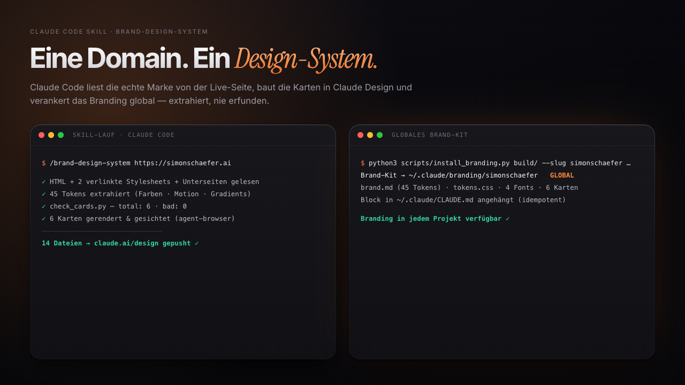

# brand-design-system



*Ich habe zu oft zugesehen, wie eine KI „irgendein" Design rät, statt die echte Marke zu benutzen. Dieser Skill beendet das: Er liest deine Live-Seite wie ein Brand-Designer mit Zugriff auf den Quellcode — und danach kennt jedes deiner Claude-Projekte deine CI. — Simon Schaefer, Juli 2026*

Die Idee: Du gibst Claude Code nur deine Domain. Der Skill lädt das HTML **und alle verlinkten Stylesheets** (dort leben Motion, Gradients und Component-States, die eine reine Startseiten-Extraktion verpasst), crawlt 2-3 Unterseiten für Hero-Backgrounds und Assets, normalisiert alles in einen kanonischen Token-Block, baut daraus Design-System-Karten (Colors mit echten WCAG-Kontrasten, Typography mit den echten Schriftdateien, Motion, Gradients, Buttons, Logo …), verifiziert sie per echtem Rendering und pusht sie als Design-System-Projekt nach [Claude Design](https://claude.ai). Optional verankert er die Marke danach global in Claude Code (`~/.claude/branding/`), sodass **jedes** Projekt auf dem Rechner die CI automatisch lädt. Erfunden wird dabei nichts — was nicht extrahierbar ist, wird abgeleitet und markiert oder ehrlich als offen gemeldet.

## How it works

- **`SKILL.md`** — der Ablauf in 6 Phasen (Extraktion → Checkpoint → Bauen → Rendern → Push → global verankern). Liest Claude, nicht du.
- **`scripts/check_cards.py`** — das Gate: Marker, lokale Fonts, definierte Tokens, keine dünnen Karten. Muss `bad: 0` melden, sonst wird nicht gepusht.
- **`scripts/build_manifest.py`** — baut den Karten-Index, der bei jedem Push mitgeschrieben wird (die Claude-Design-App indexiert sonst nur beim allerersten Laden — nachgepushte Karten blieben unsichtbar).
- **`scripts/install_branding.py`** — das globale Brand-Kit: `brand.md` + `tokens.css` + Fonts nach `~/.claude/branding/<marke>/`, auf Wunsch mit Lade-Block in der globalen `CLAUDE.md`.

Design-Konstante des Projekts: **ein** kanonischer `tokens.css`-Block, aus dem jede Karte generiert wird — nie eine Karte von Hand patchen.

## Quick start

**Requirements:** Claude Code, ein Claude-Abo mit Zugang zu Claude Design (claude.ai/design), Python 3.

```bash
# 1. Skill installieren (global = in allen Projekten verfügbar)
git clone https://github.com/simon-schaeferai/brand-design-system ~/.claude/skills/brand-design-system

# 2. Claude Code öffnen (beliebiger Ordner) und den Skill aufrufen — das ist alles
```

Wenn Claude Code danach `/brand-design-system` als Command kennt, bist du startklar.

## Using it

```
/brand-design-system https://deine-domain.de
```

Claude extrahiert, zeigt dir einen Checkpoint (Token-Tabelle, Karten-Plan, Schrift-Plan), wartet auf dein Go, baut, verifiziert, pusht — und fragt am Ende, ob es das Branding global verankern soll. Kommt beim Pushen ein Login-Hinweis: einmal `/design-login` im Terminal, „weiter" schreiben, fertig.

## Design choices

- **Verlinkte CSS sind Pflicht, nicht optional.** Die halbe Marke (Motion, Gradients) steht nie im inline-HTML. Nachteil: ein paar Requests mehr pro Lauf.
- **Grep-before-skip.** „Keine Motion" darf nur behauptet werden, wenn die Suche in allen CSS leer war. Verhindert die häufigste Auslassung, kostet Disziplin statt Rechenzeit.
- **Der Karten-Index wird selbst gebaut und immer mitgepusht.** Die App indexiert nur beim ersten Projekt-Load; ohne diesen Schritt erscheinen nachgepushte Karten nie in der Sidebar. Nachteil: eine Datei mehr im Projekt, die man nicht von Hand anfasst.
- **Echtes Rendering vor dem Push, ehrlicher Fallback.** Ohne Browser läuft nur der statische Check — und genau das steht dann im Bericht, statt „verifiziert" zu behaupten.
- **Globale CLAUDE.md nur mit Zustimmung.** Das Kit wird immer geschrieben, der Lade-Block erst nach explizitem Ja — es ist deine Datei.

## Limitations

- Der Font-Upload in Claude Design bleibt ein manueller Klick („Upload fonts") — das Tool kann ihn nicht übernehmen. Lizenzierte Schriften (Adobe/Monotype) werden nie mitgeliefert, sondern als benannter Fallback eingetragen.
- Seiten, die komplett per JavaScript rendern oder hinter Login/Bot-Schutz liegen, brauchen das Repo oder ein exportiertes Stylesheet als Quelle.
- Fremde Marken-Assets (z.B. Payment-Logos) landen als Referenz im eigenen System — weiterverteilen darfst du sie nicht.

## License

MIT
